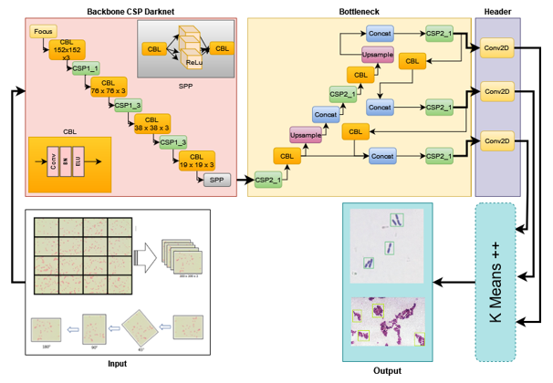
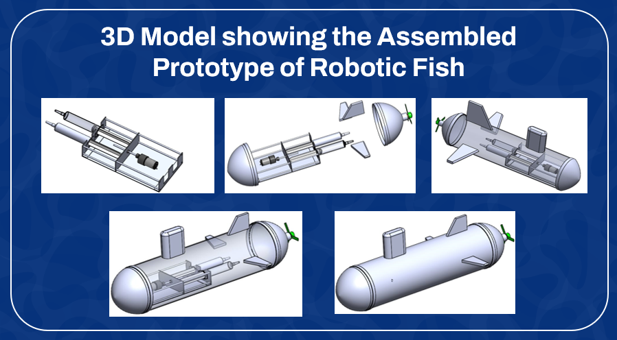

# Harnessing deep learning for faster water quality assessment: identifying bacterial contaminants in real time


[](LICENSE)
[]()
[]()

## Description
Water is essential for human survival. Humans can live without food for a few days but without water, 
a person can barely survive for 3–5 days. Various parts of the world, particularly under-developed countries, 
have regions where clean water is scarce, and humans living in such conditions have no access to clean water. 
Our solution provides information on whether water is contaminated or not. Moreover, it overcomes the delay time in getting 
the result of water contamination using traditional methods of up to 5–6 hrs. Our proposed method detects the colonies of 
the bacteria that are taken from the water sample (after gram staining) and then classifies the type of bacteria to whom 
it belongs and how much quantity of each bacterium causes infection to the human body. Bacteria detection is performed by
a novel deep learning-based model with user-specified parameters. To improve our ability to detect dangerous bacteria including
E. coli, yeast, and particles, we perform tests using datasets from a variety of researchers. On the test benchmark,
the fine-tuned proposed model achieves 84.56% accuracy and provides the level of contamination in water.



## Features

- **Water Contamination Detection:** The solution detects whether water is contaminated or not, providing vital information for human survival, especially in regions where clean water is scarce.
- **Rapid Results:** Overcomes the delay time in getting the result of water contamination using traditional methods, which can take up to 5–6 hours. This implies a significant improvement in response time, crucial for addressing water contamination promptly.
- **Bacteria Detection:** Utilizes a novel deep learning-based model to detect colonies of bacteria in water samples, post gram staining. This approach helps in identifying the type of bacteria present and their respective quantities, providing insights into potential health risks associated with water consumption.
- **Customizable Parameters:** Allows users to specify parameters for the deep learning model, enhancing flexibility and adaptability to different scenarios and datasets.
- **Comprehensive Testing:** Conducts tests using datasets from various researchers to improve the ability to detect a wide range of dangerous bacteria, including E. coli, yeast, and other particles commonly found in contaminated water sources.
- **Accuracy:** Achieves a high accuracy rate of 84.56% on test benchmarks, indicating reliable performance in detecting water contamination and identifying harmful bacteria.
- **Quantification of Contamination:** Provides information on the level of contamination in water, aiding in assessing the severity of the issue and guiding appropriate remedial actions.

## Requirements

- Python 3.8
- Django 5.0.4
- Tensorflow 2.8.0
- tensorflow-object-detection-api 0.1.1
- opencv-python 4.9.0


## Installation

The code uses **Python 3.8**.

#### Create a Conda virtual environment:

```bash
conda create --name bacteria-detection python=3.8
conda activate bacteria-detection
```

#### Clone the project and install requirements:

1. Clone the repository:

```bash
git clone [https://github.com/fahadahmedkhokhar/Bacteria-Dtection.git]
```
2. Install dependencies:
```bash
pip install -r requirement.txt
```
3. Apply migrations:
```bash
python manage.py migrate
```
4. Run the development server:
```bash
python manage.py runserver
```
## Paper:

Paper link is [here](https://doi.org/10.1007/s00371-024-03382-7)

## Hardware:
This project included the hardware which is used to collect the samples from the different places. 

## Acknowledgment:
The authors would like to thank HEC- National Research Program for Universities of Pakistan (ProjectNumber : 7794).

## Citation

If you use the Dataset and/or this code - implicitly or explicitly - for your research projects, please cite the following paper:

```
@article{khokhar2024harnessing,
  title={Harnessing deep learning for faster water quality assessment: identifying bacterial contaminants in real time},
  author={Khokhar, Fahad Ahmed and Shah, Jamal Hussain and Saleem, Rabia and Masood, Anum},
  journal={The Visual Computer},
  pages={1--12},
  year={2024},
  publisher={Springer}
}
```

## License

This project is licensed under the MIT License - see the [LICENSE](LICENSE.md) file for details.

